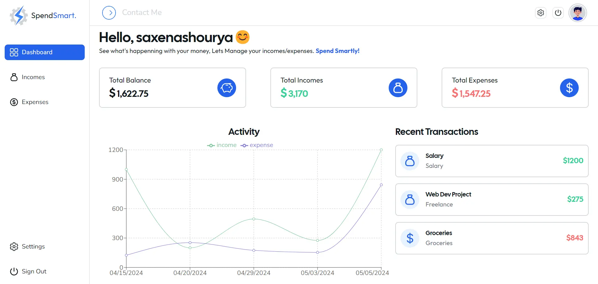

<p align="center">
  
</p>

<h1 align="center">Spend Smart – Effortless Financial Management</h1>



<h2 align="center">
  <a href="https://spend-smart-dev.vercel.app">Explore the Project Live!</a>
</h2>

<hr/>

Spend Smart is a modern platform for effortless financial management. It helps users track expenses, manage income, and stay in control of their finances with ease. Users can add transactions, visualize spending, and navigate an intuitive dashboard to make smarter financial decisions.

<hr/>

## Table of Contents

- [Features](#features)
- [Installation](#installation)
- [Experience](#experience)
- [License](#license)

<hr/>

## Features

Key features of **Spend Smart** include:

- **Expense Tracking** – Categorize and monitor daily expenses.
- **Income Management** – Add and track multiple income sources.
- **Secure Authentication** – User data protected with JWT-based authentication.
- **Insightful Reports** – Visual insights into spending and financial health.
- **Personalized Budgeting** – Set and manage customized spending limits.

<hr/>

## Installation

Follow the steps below to run Spend Smart locally.

### Prerequisites

- Node.js and npm
- MongoDB (local or cloud)
- Git

### Clone the Repository

```bash
git clone https://github.com/AadarshAdwani/Iac_Provisioning_Finance_App.git